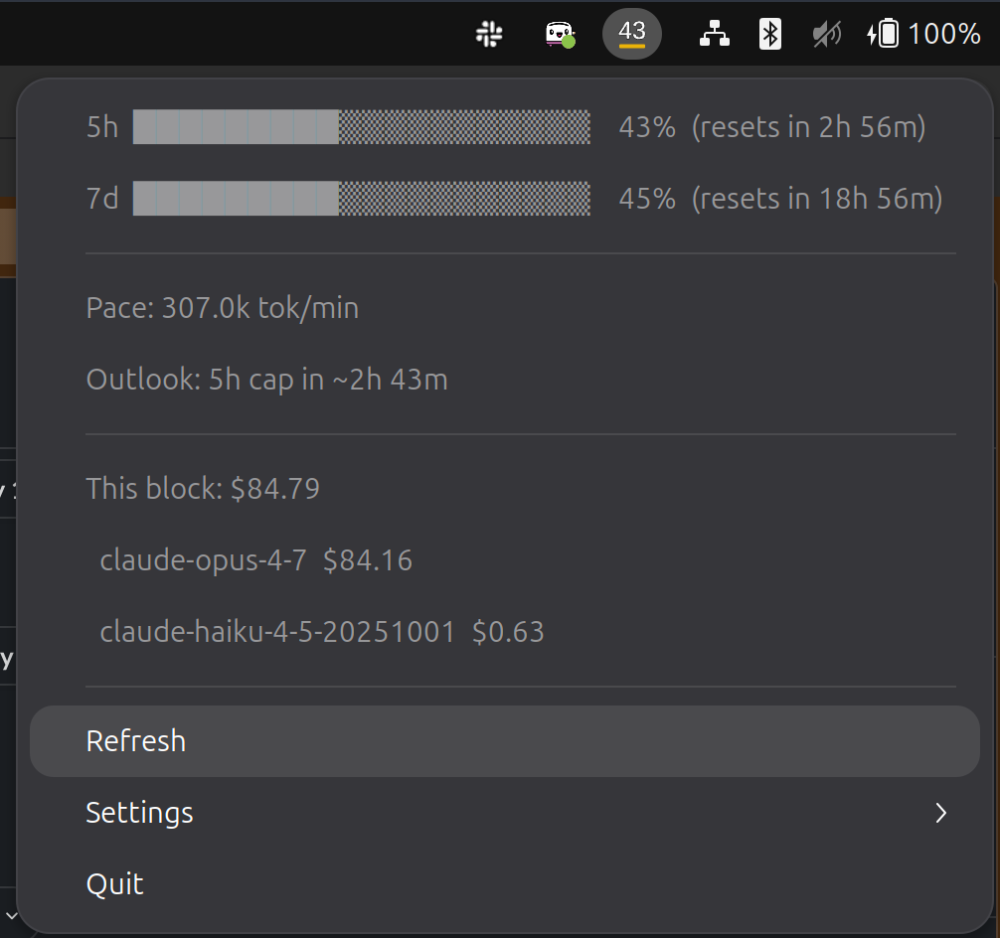

# claude-watch

**A system-tray usage meter for [Claude Code](https://claude.com/claude-code).**

See your **5-hour** and **7-day** subscription limits at a glance — without opening a terminal, refreshing a webpage, or guessing whether you're about to hit a wall in the middle of a long run.



-blue) 

---

## Quick start

**Install** (Linux, amd64 or arm64):

```bash
curl -fsSL https://raw.githubusercontent.com/jrlucier/claude-watch/main/install.sh | sh
```

Then:

```bash
claude-watch start
```

**Uninstall:**

```bash
curl -fsSL https://raw.githubusercontent.com/jrlucier/claude-watch/main/install.sh | sh -s -- --uninstall
```

See [Install](#install) for the full breakdown (manual download, building from source, environment overrides) and [Requirements](#requirements) if you're on GNOME and the tray icon doesn't appear.

---

## What it does

The tray icon is a tiny pair of stacked progress bars:

- **Top bar** → how much of your **5-hour** window you've used
- **Bottom bar** → how much of your **7-day** window you've used

Each bar turns **green → yellow → orange → red** as you approach its limit, so you can spot trouble out of the corner of your eye.

Click the icon for the full breakdown:

```
5h    42%   (resets Thu 18:30 EST)
7d    61%   (resets Sun 09:15 EST)
─────────────────────────────────
Pace        12,400 tok/min
Outlook     5h limit in ~1h 50m at current pace
─────────────────────────────────
This block  $3.41
  claude-sonnet-4-6              $2.10
  claude-opus-4-7                $1.31
```

It also fires an optional **desktop notification** when you cross **80%** or **95%** of either window (configurable), so you can wrap up gracefully instead of getting cut off mid-thought.

### Why not just use the Anthropic API or a browser extension?

`claude-watch` replaces the unmaintained [Haletran/claude-usage-extension](https://github.com/Haletran/claude-usage-extension) (GNOME extension #9231) and goes further:

| | claude-usage-extension | **claude-watch** |
|---|:---:|:---:|
| 5h / 7d % from official API | ✓ | ✓ |
| Burn rate (tokens/min) | ✗ | ✓ |
| Per-model cost breakdown | ✗ | ✓ |
| Time-to-exhaustion forecast | ✗ | ✓ |
| Threshold notifications | ✗ | ✓ |
| Stale-data resilient | ✗ | ✓ |
| Re-polls instantly on token refresh | ✗ | ✓ |
| CLI for scripts (`status --json`) | ✗ | ✓ |
| Actively maintained | ✗ | ✓ |

### How does it know your usage?

Two data sources, blended:

1. **Anthropic's OAuth usage API** — the authoritative source for the 5h / 7d percentages. Polled every 5 minutes (the API rate-limits faster polling).
2. **Local JSONL transcripts** in `~/.claude/projects/**/*.jsonl` — what powers the burn rate, per-model cost, and time-to-exhaustion forecast. Re-read every 30 seconds.

When the `claude` CLI refreshes its OAuth token, `claude-watch` notices via `fsnotify` on `~/.claude/.credentials.json` and re-polls within a second. If the API hiccups, the icon **keeps showing the last-known values** with a `⚠ stale` hint — never blank.

---

## Requirements

- **Linux** (GNOME, KDE Plasma, or any desktop with a system tray)
- **Go 1.26+** to build from source
- An active **Claude Code** subscription with credentials at `~/.claude/.credentials.json` (created automatically the first time you run `claude` and sign in)

### GNOME-specific

GNOME doesn't ship a system tray by default. `claude-watch` will automatically try to enable one of these extensions for you:

- `ubuntu-appindicators@ubuntu.com` (preferred on Ubuntu)
- `appindicatorsupport@rgcjonas.gmail.com` (upstream fallback)

If neither is installed, install one first:

```bash
# Ubuntu / Debian
sudo apt install gnome-shell-extension-appindicator

# Fedora
sudo dnf install gnome-shell-extension-appindicator

# Or grab it from https://extensions.gnome.org/extension/615/appindicator-support/
```

Then log out and back in once so GNOME picks it up.

---

## Install

### Option 1: One-line install (recommended)

```bash
curl -fsSL https://raw.githubusercontent.com/jrlucier/claude-watch/main/install.sh | sh
```

That's it. The script:

- detects your CPU architecture (amd64 or arm64),
- downloads the matching binary from the [latest GitHub release](https://github.com/jrlucier/claude-watch/releases/latest),
- verifies the SHA-256 checksum,
- installs it to `~/.local/bin/claude-watch`,
- prompts you (on systemd-based distros) to set up **auto-start on login**.

**Environment overrides:**

```bash
INSTALL_DIR=/usr/local/bin sudo -E sh -c "$(curl -fsSL https://raw.githubusercontent.com/jrlucier/claude-watch/main/install.sh)"
VERSION=v0.1.0 sh install.sh             # pin to a specific release
CLAUDE_WATCH_AUTOSTART=yes sh install.sh  # skip the auto-start prompt and just do it
CLAUDE_WATCH_AUTOSTART=no  sh install.sh  # skip the prompt and don't auto-start
```

If `~/.local/bin` isn't on your `$PATH`, the script will tell you and print the exact line to add to your shell config.

### Uninstall

```bash
curl -fsSL https://raw.githubusercontent.com/jrlucier/claude-watch/main/install.sh | sh -s -- --uninstall
```

Stops the daemon, disables and removes the systemd user unit, and deletes the binary. You'll be prompted whether to also remove your config (`~/.config/claude-watch`) and logs (`~/.local/state/claude-watch`) — answer "no" to keep them around for a future reinstall. Use `CLAUDE_WATCH_PURGE=yes` to skip that prompt and wipe everything.

### Option 2: Download manually

Grab the archive for your CPU from [**Releases**](https://github.com/jrlucier/claude-watch/releases/latest):

| Your system | Download |
|---|---|
| Linux (Intel/AMD) | `claude-watch-vX.Y.Z-linux-amd64.tar.gz` |
| Linux (ARM64) | `claude-watch-vX.Y.Z-linux-arm64.tar.gz` |

```bash
tar -xzf claude-watch-v0.1.0-linux-amd64.tar.gz
install -m 0755 claude-watch ~/.local/bin/
```

### Option 3: Build from source

Requires **Go 1.26+**.

```bash
git clone https://github.com/jrlucier/claude-watch
cd claude-watch
make build
install -m 0755 bin/claude-watch ~/.local/bin/
```

### Verify it's installed

```bash
claude-watch version
```

---

## Usage

### Start the tray icon

```bash
claude-watch start
```

That's it — the daemon spawns in the background, the tray icon appears, and it starts polling. Quit your shell, log out, log back in; the daemon keeps running independently.

### All commands

| Command | What it does |
|---|---|
| `claude-watch start` | Spawn the background daemon and show the tray icon. |
| `claude-watch status` | One-line snapshot in your terminal. |
| `claude-watch status --json` | Same data, JSON-formatted (great for scripts and status bars). |
| `claude-watch refresh` | Force an immediate API + JSONL refresh. |
| `claude-watch set-label 5h` | Panel label shows just `5h XX%` (default — saves space). |
| `claude-watch set-label both` | Panel label shows `5h XX% / 7d YY%`. |
| `claude-watch quit` | Stop the daemon. |
| `claude-watch version` | Print the build version. |

Any non-`start` command **auto-spawns the daemon** if it isn't running yet — so you can just run `claude-watch status` cold and it'll do the right thing.

### Example: scripting

```bash
$ claude-watch status --json | jq '.fiveHour.utilization'
42.3
```

---

## Configuration

`claude-watch` reads `~/.config/claude-watch/config.toml` (or `$XDG_CONFIG_HOME/claude-watch/config.toml` if set). The file is optional — defaults are baked in.

```toml
# How often to call the Anthropic usage API.
# Floor is 300 (5 min). Faster polling triggers HTTP 429 rate limits.
api_refresh_seconds   = 300

# How often to re-scan local JSONL transcripts for burn rate / cost.
jsonl_refresh_seconds = 30

# Panel label: "5h" (compact) or "both" (5h XX% / 7d YY%).
label_mode            = "5h"

# Optional HTTP/HTTPS proxy for API calls. Empty = direct connection.
proxy_url             = ""

# Send a desktop notification when crossing these % thresholds.
# Empty list = no notifications.
notify_thresholds     = [80, 95]
```

You can also toggle `label_mode` from the **Settings** submenu on the tray icon — it persists back to the config file.

---

## Auto-start on login

> The [one-line installer](#option-1-one-line-install-recommended) will offer to do all of this for you. The steps below are if you want to set it up manually.

The unit assumes the binary lives at `~/.local/bin/claude-watch`. If you haven't already, install it there:

```bash
install -m 0755 bin/claude-watch ~/.local/bin/
```

Create `~/.config/systemd/user/claude-watch.service`:

```ini
[Unit]
Description=Claude Code usage tray indicator
After=graphical-session.target

[Service]
ExecStart=%h/.local/bin/claude-watch start --foreground
Restart=on-failure

[Install]
WantedBy=default.target
```

Then enable and start it:

```bash
systemctl --user daemon-reload
systemctl --user enable --now claude-watch
```

Verify:

```bash
systemctl --user status claude-watch
```

> **If it fails with `status=203/EXEC`:** systemd can't find the binary at `~/.local/bin/claude-watch`. Re-run the `install` command above, then `systemctl --user reset-failed claude-watch && systemctl --user start claude-watch`.

---

## Logs & troubleshooting

Daemon logs live at:

```
~/.local/state/claude-watch/daemon.log
```

(`$XDG_STATE_HOME/claude-watch/daemon.log` if you've set `$XDG_STATE_HOME`.)

### Common issues

**Tray icon doesn't appear on GNOME.**
You're missing the AppIndicator extension. See the [GNOME-specific section](#gnome-specific) above.

**Icon shows `⚠ stale` and won't update.**
The Anthropic API is rejecting requests (rate limit, network blip, or expired credentials). Check `daemon.log`. If your `claude` CLI is also failing, re-authenticate it (`claude` → sign in again); `claude-watch` will pick up the new credentials within a second.

**`claude-watch: command not found`.**
`~/.local/bin` isn't on your `$PATH`. Either move the binary to `/usr/local/bin` (needs `sudo`) or add `export PATH="$HOME/.local/bin:$PATH"` to your shell config.

---

## License

MIT.
